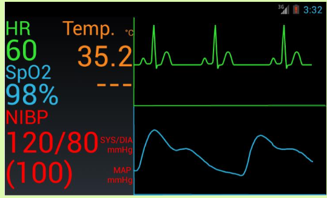
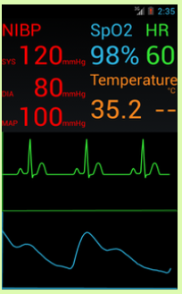

# Android 2014 Sample GUI
In 2014, I had to make a presentation poster for my Summer Research. 

I didnt know how to do a wireframe for the UI, so I made my idea for the actual UI on Android Studio, instead. 
I learnt Android UI code over the weekend and pulled an all nighter to make this. LOL

## Features
* landscape and portrait modes.
* fake Temperature and blood oxygen (spo2) data
* fake blood pressure and pulse data
* fake ECG graph and blood oxygen (spo2) graph
* Graph refreshes every few seconds
* last point of finished graph is first point of old graph

## Screenshots
### Landscape

### Portrait

